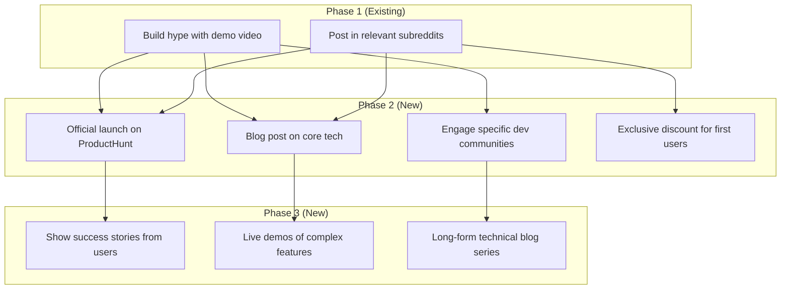
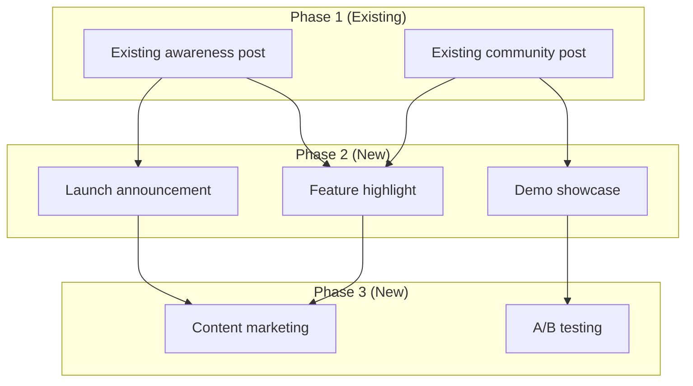

# Strategy Regeneration Feature

## Overview

The Strategy Planner Agent now supports **partial strategy regeneration**, allowing you to regenerate a campaign strategy from a specific phase onwards while preserving existing posts from earlier phases.

This feature is essential for:
- Pivoting strategy mid-campaign based on performance data
- Exploring alternative approaches for later phases
- Adapting to new market conditions or user feedback
- Expanding campaigns beyond the original 3 phases

## Key Features

### 1. Phase-Based Regeneration
Regenerate strategy starting from any phase (2, 3, or beyond) while keeping earlier phases intact.

### 2. Many-to-Many Connections
- **Branching**: One existing post can connect to multiple new posts
- **Merging**: Multiple existing posts can connect to one new post
- Connections are determined by content relevance and strategy flow

### 3. Variable Node Count
- Generate **2-5 nodes per new phase** (increased from fixed 3-node limit)
- Allows for richer, more nuanced strategies
- Better supports complex branching and merging patterns

### 4. Smart Connection Logic
The AI analyzes:
- Content themes and topics
- Phase progression logic (awareness → launch → growth)
- Strategic relationships between posts
- Campaign goals and new direction

### 5. Flexible Phase Count
- Not limited to 3 phases
- Can extend to Phase 4, Phase 5, etc. as needed
- Useful for long-running campaigns

## API Reference

### Method Signature

```python
def execute_from_phase(
    self,
    phase_num: int,
    existing_posts: List[Dict[str, Any]],
    product_description: str,
    gtm_goals: str,
    new_direction: str
) -> StrategyOutput
```

### Parameters

| Parameter | Type | Description |
|-----------|------|-------------|
| `phase_num` | `int` | Phase number to start regeneration from (e.g., 2 means regenerate Phase 2 onwards) |
| `existing_posts` | `List[Dict]` | List of existing posts from Phase 1 to Phase (phase_num - 1) |
| `product_description` | `str` | Description of the product being marketed |
| `gtm_goals` | `str` | Go-to-market goals and objectives |
| `new_direction` | `str` | New strategic direction or pivot reason |

### Existing Posts Format

Each post dictionary should contain:

```python
{
    "node_id": "NODE1",          # Mermaid node identifier
    "post_id": "post_001",       # Database post ID
    "title": "Demo video on X",  # Post title
    "description": "Build hype",  # Post description
    "phase": "Phase 1"           # Phase label
}
```

### Return Value

Returns `StrategyOutput` containing:
- `diagram` (str): Complete Mermaid diagram with both existing and new phases

## Usage Examples

### Example 1: Regenerate from Phase 2

```python
from agents.strategy_planner import create_strategy_planner

agent = create_strategy_planner()

# Existing Phase 1 posts
existing_posts = [
    {
        "node_id": "NODE1",
        "post_id": "post_001",
        "title": "Demo video on X",
        "description": "Build hype with demo video",
        "phase": "Phase 1"
    },
    {
        "node_id": "NODE2",
        "post_id": "post_002",
        "title": "Community engagement",
        "description": "Post in relevant subreddits",
        "phase": "Phase 1"
    }
]

# Regenerate from Phase 2
result = agent.execute_from_phase(
    phase_num=2,
    existing_posts=existing_posts,
    product_description="Janus - AI-powered GTM OS for technical founders",
    gtm_goals="Launch product and acquire first 100 users in 4 weeks",
    new_direction="Focus on ProductHunt launch with heavy emphasis on developer communities"
)

print(result.diagram)
```

**Output:**


### Example 2: Regenerate from Phase 3

```python
# Existing Phase 1 and Phase 2 posts
existing_posts = [
    {"node_id": "NODE1", "title": "Demo video", "phase": "Phase 1", ...},
    {"node_id": "NODE2", "title": "Community post", "phase": "Phase 1", ...},
    {"node_id": "NODE3", "title": "PH launch", "phase": "Phase 2", ...},
    {"node_id": "NODE4", "title": "Launch thread", "phase": "Phase 2", ...}
]

# Pivot to growth strategy
result = agent.execute_from_phase(
    phase_num=3,
    existing_posts=existing_posts,
    product_description="Janus - AI-powered GTM OS",
    gtm_goals="Scale to 500 users and achieve 80% activation rate",
    new_direction="Focus on content marketing, partnerships, and aggressive A/B testing"
)
```

**Output:** Generates Phase 3 (and potentially Phase 4) with new growth-focused posts connected to existing Phase 2 posts.

### Example 3: Django Integration

```python
from agents.strategy_planner import create_strategy_planner
from agents.models import Campaign, Post

# Load existing campaign data from database
campaign = Campaign.objects.get(campaign_id="campaign_001")
existing_phase_1_posts = Post.objects.filter(campaign=campaign, phase="Phase 1")

# Convert Django models to dictionary format
existing_posts = [
    {
        "node_id": post.node_id,
        "post_id": post.post_id,
        "title": post.title,
        "description": post.description,
        "phase": post.phase
    }
    for post in existing_phase_1_posts
]

# Regenerate based on performance data
agent = create_strategy_planner()
result = agent.execute_from_phase(
    phase_num=2,
    existing_posts=existing_posts,
    product_description=campaign.description,
    gtm_goals=campaign.metadata.get('gtm_goals', ''),
    new_direction="Phase 1 posts underperformed. Pivot to technical content and developer influencers."
)

# Update campaign with new strategy
campaign.strategy = result.diagram
campaign.save()
```

## Mermaid Output Format

The generated Mermaid diagram follows this structure:

### Existing Phases
```mermaid
subgraph "Phase N (Existing)"
    NODEX[<title>Title</title><description>Description</description>]
end
```

### New Phases
```mermaid
subgraph "Phase N (New)"
    NODEY[<title>Title</title><description>Description</description>]
end
```

### Connections
```mermaid
NODEX --> NODEY  # Existing to new
NODEY --> NODEZ  # New to new
```

### Complete Example


## Connection Patterns

### Branching (1 → Many)
One existing post connects to multiple new posts:
```mermaid
NODE1 --> NODE3
NODE1 --> NODE4
NODE1 --> NODE5
```

**Use case:** Awareness post branches into multiple launch strategies

### Merging (Many → 1)
Multiple existing posts connect to one new post:
```mermaid
NODE1 --> NODE5
NODE2 --> NODE5
NODE3 --> NODE5
```

**Use case:** Multiple Phase 1 posts converge into single ProductHunt launch

### Mixed Patterns
Combination of branching and merging:
```mermaid
NODE1 --> NODE3
NODE1 --> NODE4  # Branching
NODE2 --> NODE4
NODE2 --> NODE5  # Branching
NODE3 --> NODE6
NODE4 --> NODE6  # Merging
NODE5 --> NODE6  # Merging
```

**Use case:** Complex campaign with parallel paths that converge

## Implementation Details

### System Prompt Design

The regeneration agent uses a specialized system prompt that:

1. **Instructs phase labeling**: "(Existing)" vs "(New)"
2. **Requires node preservation**: Use original node IDs for existing posts
3. **Enables many-to-many**: Explicitly supports branching and merging
4. **Increases node count**: 2-5 nodes per phase instead of fixed 3
5. **Guides connection logic**: Connect based on content relevance and strategy flow

### Agent Creation

```python
regeneration_agent = create_agent(
    self.model,
    tools=[],  # No external tools needed
    system_prompt=self._get_system_prompt(regeneration_mode=True)
)
```

The regeneration agent is created on-demand with a modified system prompt while keeping the base model configuration (temperature=0 for consistent output).

### Post Formatting

Existing posts are formatted into a human-readable text structure:

```
Phase 1:
  - NODE1: Demo video on X
    Description: Build hype with demo video
  - NODE2: Community engagement
    Description: Post in relevant subreddits
```

This format helps the LLM understand:
- Node IDs to preserve
- Content themes to connect with
- Phase structure to respect

## Testing

Run the comprehensive test suite:

```bash
cd backend
python test_strategy_regeneration.py
```

Tests cover:
1. ✅ Regeneration from Phase 2
2. ✅ Regeneration from Phase 3 (with Phase 4 extension)
3. ✅ Many-to-many connection patterns
4. ✅ Variable node count (2-5 per phase)

Run individual regeneration test:

```bash
cd backend/src
python -m agents.strategy_planner --regenerate
```

## Best Practices

### When to Use Regeneration

✅ **Good use cases:**
- Phase 1 launched, but metrics suggest need for new Phase 2 strategy
- External market changes require strategic pivot
- A/B testing results indicate need for different approach
- Expanding successful campaign beyond original 3 phases

❌ **Avoid using when:**
- No existing posts yet (use regular `execute()` method)
- Existing posts are still pending/draft (wait for publishing)
- Changes needed are minor (consider just editing post content)

### Connection Strategy

**For awareness → launch connections:**
- Demo posts → Feature highlights, launch announcements
- Community posts → Targeted community launches

**For launch → growth connections:**
- ProductHunt launch → Case studies, testimonials
- Announcement posts → Content marketing, SEO

**For complex campaigns:**
- Use branching to test multiple approaches simultaneously
- Use merging to consolidate efforts into major milestones

### Node Count Guidelines

- **2 nodes**: Minimal strategy, focused approach
- **3 nodes**: Balanced strategy (default for original method)
- **4-5 nodes**: Rich strategy with parallel paths

### New Direction Prompting

Be specific in the `new_direction` parameter:

✅ **Good:**
```python
new_direction = "Focus on ProductHunt launch with heavy emphasis on developer communities and technical content. Create multiple parallel launch strategies targeting HackerNews, Reddit r/programming, and Dev.to."
```

❌ **Vague:**
```python
new_direction = "Make it better"
```

## Limitations

1. **Node ID Preservation**: Existing node IDs must not conflict with new ones (handled automatically by sequential numbering)
2. **Phase Ordering**: Cannot skip phases (e.g., can't regenerate Phase 4 without Phase 3)
3. **Temperature**: Uses temperature=0 for consistency (not configurable in regeneration mode)
4. **LLM Dependency**: Connection logic depends on Gemini's understanding of content relationships

## Future Enhancements

Potential improvements:
- [ ] Support for selective node regeneration (keep some Phase 2 posts, regenerate others)
- [ ] Connection suggestions with confidence scores
- [ ] Automatic trigger detection (regenerate when metrics drop below threshold)
- [ ] Multi-path strategy generation with variant comparison
- [ ] Integration with metrics analyzer for data-driven regeneration prompts

## Related Documentation

- [Main README](/home/sllee/coding/aiatl/README.md) - Project overview
- [Backend CLAUDE.md](/home/sllee/coding/aiatl/backend/CLAUDE.md) - Backend architecture
- [Strategy Planner Source](/home/sllee/coding/aiatl/backend/src/agents/strategy_planner.py) - Implementation code
- [Mermaid Parser](/home/sllee/coding/aiatl/backend/src/agents/mermaid_parser.py) - Diagram parsing logic

## Support

For issues or questions:
1. Check test suite output: `python test_strategy_regeneration.py`
2. Review Mermaid diagram syntax in output
3. Verify existing_posts format matches expected structure
4. Check Django logs for database errors
